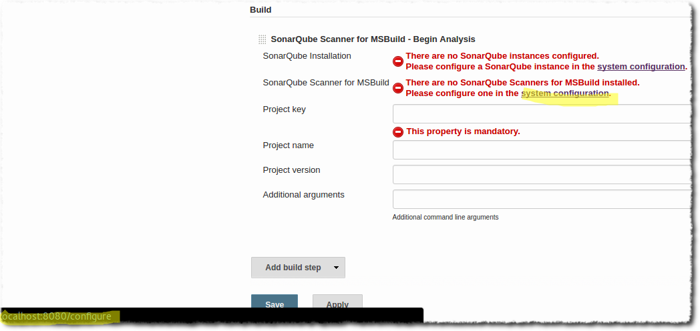

This project provides Docker images to tests some features of the SonarQube scanner for Jenkins related to
* Jenkins 2
* Jenkins pipeline (available in later version of Jenkins 1 and in Jenkins 2)

It provides the different Docker images:
* [test-sonarqube-jenkins-pipeline:jenkins1](https://github.com/drautureau-sonarsource/test-sonarqube-jenkins-scanner/tree/master/jenkins1):
the latest Jenkins LTS 1.X series with materials required to test SonarQube Jenkins scanner (without any configuration related to SonarQube)
* [test-sonarqube-jenkins-pipeline:jenkins2-base](https://github.com/drautureau-sonarsource/test-sonarqube-jenkins-scanner/tree/master/jenkins2/base) 
Jenkins 2.7.3 with materials required to test SonarQube Jenkins scanner (without any configuration related to SonarQube)

# Preparing the environment

## Build ```test-sonarqube-jenkins-pipeline:jenkins1``` Docker image
```
cd jenkins1
docker build -t test-sonarqube-jenkins-pipeline:jenkins1 .
``` 

## Build ```test-sonarqube-jenkins-pipeline:jenkins2-base``` Docker image
```
cd jenkins2/base
docker build -t test-sonarqube-jenkins-pipeline:jenkins2-base .
```

# Testing

## [SONARJNKNS-270 - Invalid link to configure installable tools with Jenkins 2.x](https://jira.sonarsource.com/browse/SONARJNKNS-270)

### Validating with ```test-sonarqube-jenkins-pipeline:jenkins2-base``` Docker image:
>SonarQube Scanner for MSBuild and SonarQube Scanner installations must be configured at http://localhost:8080/configureTools
>
>

To run Jenkins:
```
docker run --rm -p 2222:2222 -p 8080:8080 -p 8081:8081 -p 9418:9418 -ti test-sonarqube-jenkins-pipeline:jenkins2-base
```

* Validated on FreeStyle projects (Go to http://localhost:8080/job/freestyle-job/configure to create the steps)
  * with a ```Execute SonarQube Scanner``` Build Step:


  * with a ```SonarQube Scanner for MSBuild -Begin Analysis``` Build Step:


* Validated on Pipleline project (Go to http://localhost:8080/job/pipeline-job/pipeline-syntax/)
  * with a ```Execute SonarQube Scanner``` General Build Step:


  * with a ```SonarQube Scanner for MSBuild - Begin Analysis``` General Build Step:


  * with a ```sonarScanner: Execute SonarQube Scanner``` Step:


  * with a ```sonarScannerMSBuildBegin: SonarQube Scanner for MSBuild - Begin Analysis``` Step:


### Testing non regression on Jenkins 1 with ```test-sonarqube-jenkins-pipeline:jenkins1``` Docker image:
>SonarQube Scanner for MSBuild and SonarQube Scanner installations must be configured at http://localhost:8080/configure
>
>

To run Jenkins:
 ```
 docker run --rm -p 2222:2222 -p 8080:8080 -p 8081:8081 -p 9418:9418 -ti test-sonarqube-jenkins-pipeline:jenkins1
 ```

* Validated on FreeStyle projects (Go to http://localhost:8080/job/freestyle-job/configure to create the steps)
  * with a ```Execute SonarQube Scanner``` Build Step:


  * with a ```SonarQube Scanner for MSBuild - Begin Analysis``` Build Step:



* Validated on Pipleline project (Go to http://localhost:8080/job/pipeline-job/pipeline-syntax/)

  * with a ```Execute SonarQube Scanner``` General Build Step:


  * with a ```sonarScannerMSBuildBegin: SonarQube Scanner for MSBuild - Begin Analysis``` Step:


Please note that ```sonarScanner: Execute SonarQube Scanner``` and ```sonarScannerMSBuildBegin: SonarQube Scanner for MSBuild - Begin Analysis``` steps are not available on Jenkins 1 because it is a Jenkins 2 feature.

## [SONARJNKNS-253 - Make Inject SonarQube environment (SonarBuildWrapper) compatible with pipeline](https://jira.sonarsource.com/browse/SONARJNKNS-253)

### Validating with ```test-sonarqube-jenkins-pipeline:jenkins2-base``` Docker image:
>As there is no SonarQube instance configured an error must be displayed in the Pipeline syntax editor

To run Jenkins:
```
docker run --rm -p 2222:2222 -p 8080:8080 -p 8081:8081 -p 9418:9418 -ti test-sonarqube-jenkins-pipeline:jenkins2-base
```

Validated using Pipeline syntax (Go to http://localhost:8080/job/pipeline-job/pipeline-syntax/)


### Validating with 1 Jenkins and 2 SonarQube:
>Environment variable must be available and protected variable should not be seen
>By default the 1st instance of SonarQube must be used if not specified
>The SonarBuildWrapper must take a SonarQube installation when more than 1 are configured

To run Jenkins and SonarQube instances:
```
cd jenkins2/withSQ
docker-compose up
```

* Validated running the [SONARJNKNS-253 Jenkins job](http://localhost:8080/job/SONARJNKNS-253/)
  * the ```Check environment``` stage checks that we can access to environment variable (except protected ones)
  * the ```Analyse with default``` stage checks that the 1st instance of SonarQube is used when not defined
  * the ```Analyse with Localhost``` stage checks that the ```Localhost``` instance of SonarQube is used (result of analyse is available at http://localhost:9000/)
  * the ```Analyse with Other``` stage checks that the ```Other``` instance of SonarQube is used (result of analyse is available at http://localhost:9001/)


* Validated using Pipeline syntax (Go to http://localhost:8080/job/pipeline-job/pipeline-syntax/)


## [SONARJNKNS-252 - Make SonarQube Scanner step compatible with pipeline](https://jira.sonarsource.com/browse/SONARJNKNS-252)

### Validating with ```test-sonarqube-jenkins-pipeline:jenkins2-base``` Docker image:
>As there is no SonarQube Scanner instance configured an error must be displayed in the Pipeline syntax editor

To run Jenkins:
```
docker run --rm -p 2222:2222 -p 8080:8080 -p 8081:8081 -p 9418:9418 -ti test-sonarqube-jenkins-pipeline:jenkins2-base
```

Validated using Pipeline syntax (Go to http://localhost:8080/job/pipeline-job/pipeline-syntax/)


### Validating with 1 Jenkins and 2 SonarQube and 2 SonarQube Scanner:
>The arguments that are not set must be ignore from the step arguments, arguments set must be available in the parameters of the step
>By default the 1st instance of SonarQube must be used if not specified
>By default the 1st instance of SonarQube Scanner must be used if not specified
>By default the 1st instance of JDK tool must be used if not specified

To run Jenkins and SonarQube instances:
```
cd jenkins2/withSQ
docker-compose up
```

* Validated using Pipeline syntax (Go to http://localhost:8080/job/pipeline-job/pipeline-syntax/): the arguments not set are ignored from the arguments of the step


* Validated running the [SONARJNKNS-252 Jenkins job](http://localhost:8080/job/SONARJNKNS-252/)
  * the ```Analyse with default``` stage checks that the 1st instance of SonarQube is used when not defined, 1 instance of SonarQube Scanner is used when not specified, default JDK is used when not specified
  * the ```Analyse with Localhost and Scanner 2.8``` stage checks that the ```Localhost``` instance of SonarQube is used (result of analyse is available at http://localhost:9000/) and ```SonarQube Scanner 2.8``` is used
  * the ```Analyse with Other and Scanner 2.7``` stage checks that the ```Other``` instance of SonarQube is used (result of analyse is available at http://localhost:9001/) and ```SonarQube Scanner 2.7``` is used


## [SONARJNKNS-265 - In Scanner for MSBuild Start steps, project name and version should not be mandatory](https://jira.sonarsource.com/browse/SONARJNKNS-265)
>The project name and version fields no longer raise validation errors.

Validated with ```test-sonarqube-jenkins-pipeline:jenkins2-base``` Docker image using Pipeline syntax (Go to http://localhost:8080/job/pipeline-job/pipeline-syntax/)

To run Jenkins:
```
docker run --rm -p 2222:2222 -p 8080:8080 -p 8081:8081 -p 9418:9418 -ti test-sonarqube-jenkins-pipeline:jenkins2-base
```


## [SONARJNKNS-254 - Make MSBuild Scanner steps compatible with pipeline](https://jira.sonarsource.com/browse/SONARJNKNS-254)

### Validating with ```test-sonarqube-jenkins-pipeline:jenkins2-base``` Docker image:
>As there is no SonarQube Scanner instance configured an error must be displayed in the Pipeline syntax editor

To run Jenkins:
```
docker run --rm -p 2222:2222 -p 8080:8080 -p 8081:8081 -p 9418:9418 -ti test-sonarqube-jenkins-pipeline:jenkins2-base
```

Validated using Pipeline syntax (Go to http://localhost:8080/job/pipeline-job/pipeline-syntax/)


### Validating with 1 Jenkins and 2 SonarQube and 2 SonarQube Scanner:
>The arguments that are not set must be ignore from the step arguments, arguments set must be available in the parameters of the step
>By default the 1st instance of SonarQube must be used if not specified
>By default the 1st instance of SonarQube Scanner for MSBuild must be used if not specified

To run Jenkins and SonarQube instances:
```
cd jenkins2/withSQ
docker-compose up
```

You need a windows slave with MSBuild and git configured to be able to run the next tests!

**Not validated** running the [SONARJNKNS-254 Jenkins job](http://localhost:8080/job/SONARJNKNS-254/): The sonarScannerMSBuildEnd() does not inherit from the envrionment.
* the ```Before build with default``` and ```Analyse with default``` stages check that the 1st instance of SonarQube is used when not defined, 1 instance of SonarQube Scanner for MSBuild is used when not specified
* the ```Before build with Localhost and SonarQube Scanner for MSBuild 2.1``` and ```Analyse with Localhost and SonarQube Scanner for MSBuild 2.1``` stages check that the ```Localhost``` instance of SonarQube is used (result of analyse is available at http://localhost:9000/) and ```SonarQube Scanner for MSBuild 2.1``` is used
* the ```Before build with Other and SonarQube Scanner for MSBuild 2.0``` and ```Analyse with Other and SonarQube Scanner for MSBuild 2.0``` stages check that the ```Other``` instance of SonarQube is used (result of analyse is available at http://localhost:9000/) and ```SonarQube Scanner for MSBuild 2.0``` is used


## [SONARJNKNS-264 - Use new 'sonar-scanner' executable in the SQ Scanner step](https://jira.sonarsource.com/browse/SONARJNKNS-264)
>The ```sonar-scanner``` executable must be called
>JVM options should be passed using SONAR_SCANNER_OPTS
>No more deprecation messages in the logs

To run Jenkins and SonarQube instances:
```
cd jenkins2/withSQ
docker-compose up
```

Validated running the [SONARJNKNS-264 Jenkins job](http://localhost:8080/job/SONARJNKNS-264/)


## [SONARJNKNS-263 - Make the "Build Environment" feature populate SONARQUBE_SCANNER_PARAMS](https://jira.sonarsource.com/browse/SONARJNKNS-263)
>The environment variable ```SONARQUBE_SCANNER_PARAMS``` must be populated

To run Jenkins and SonarQube instances:
```
cd jenkins2/withSQ
docker-compose up
```

Validated running the [SONARJNKNS-263 Jenkins job](http://localhost:8080/job/SONARJNKNS-263/)


## [SONARJNKNS-271 - Odd "Additional command line arguments" text (hint?)](https://jira.sonarsource.com/browse/SONARJNKNS-271)

Validated with ```test-sonarqube-jenkins-pipeline:jenkins2-base``` Docker image using Pipeline syntax (Go to http://localhost:8080/job/pipeline-job/pipeline-syntax/)

To run Jenkins:
```
docker run --rm -p 2222:2222 -p 8080:8080 -p 8081:8081 -p 9418:9418 -ti test-sonarqube-jenkins-pipeline:jenkins2-base
```


Also validated for any other Scanner

## [SONARJNKNS-262 - Don't save Global configuration on startup if there is no migration to be done](https://jira.sonarsource.com/browse/SONARJNKNS-262)

TODO

# Thoughts

Would be cool to automatically add the property ```-Dsonar.links.ci=${env.JOB_URL}``` which create the links from the SonarQube project to the Jenkins job.

